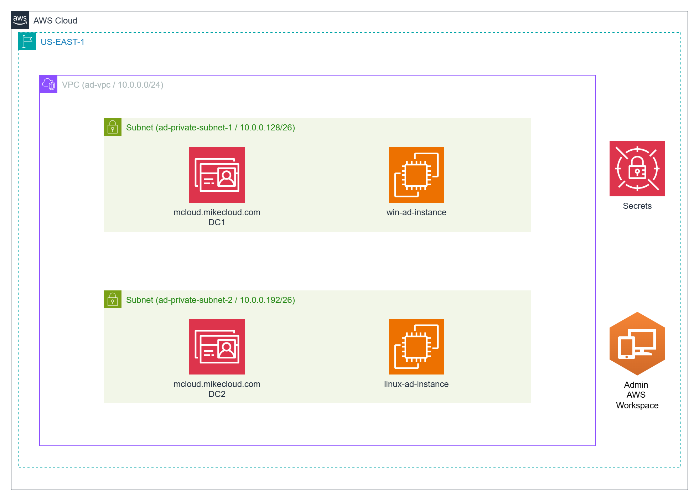
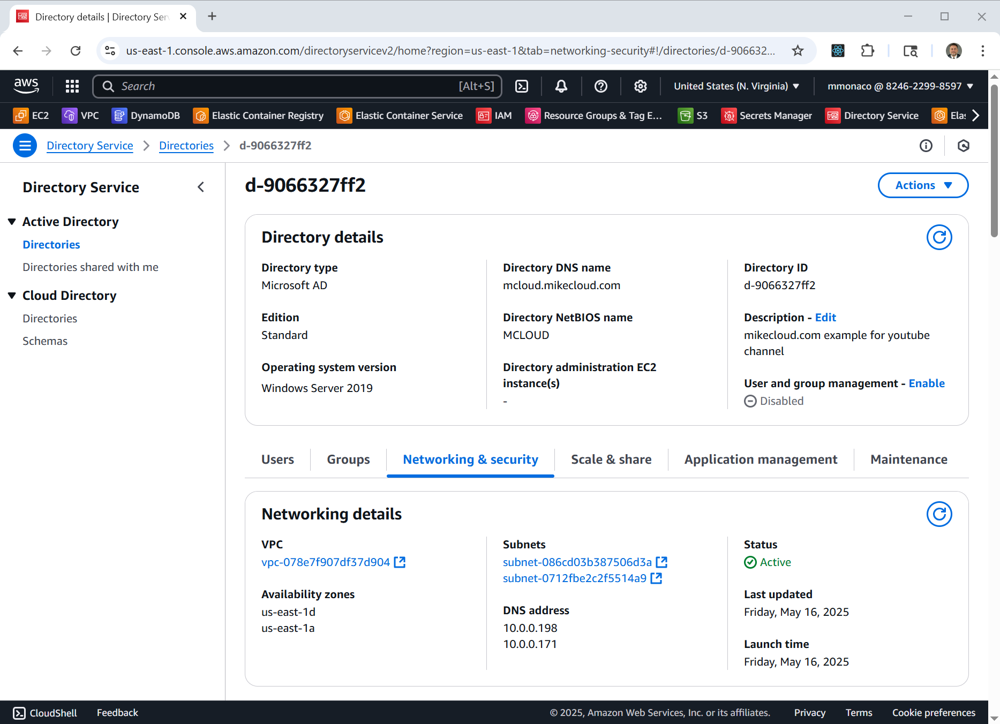
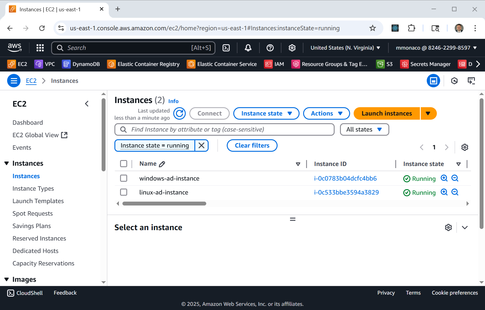
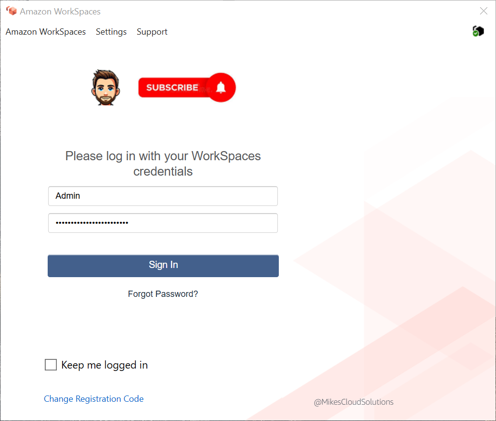
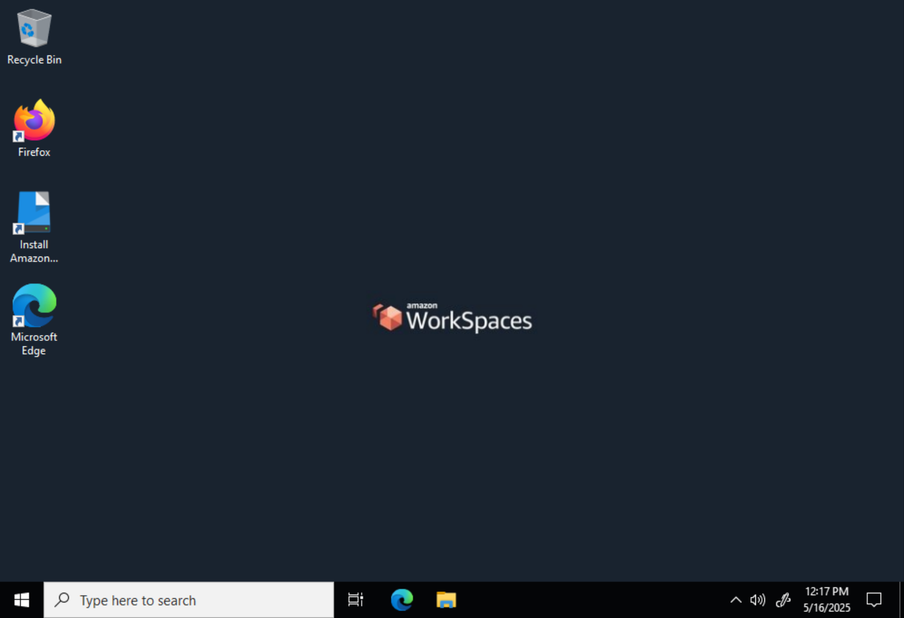

# AWS WorkSpaces

This is a follow-up to the [AWS Directory Service](https://youtu.be/1lnSxfFmGPY) video and [GitHub Project](https://github.com/mamonaco1973/aws-active-directory/blob/main/README.md).
The project materials for AWS workspaces shows up in the `workspaces` branch in the original project.

## Introduction

In the original [**AWS Directory Service** project](https://github.com/mamonaco1973/aws-active-directory), we deployed:

- An Active Directory domain: `mcloud.mikecloud.com` in us-east-2
- Several users and groups in Active Directory
- A public Linux EC2 instance joined to the domain (SSH enabled)
- A public Windows EC2 instance joined to the domain (RDP enabled)

## What This Project Adds

This project builds upon the original by making the following changes:

- EC2 instances will be moved to **private subnets**, removing public exposure.
- The deployment will be moved to the **`us-east-1`** region, as **WorkSpaces are not supported** in us-east-2.
- The `mcloud.mikecloud.com` domain will be **registered for AWS WorkSpaces**.
- A WorkSpace will be provisioned for the **`Admin` Active Directory user**.
- The WorkSpace acts as a secure access point to reach private EC2 instances within the VPC. In this setup, the WorkSpace effectively functions as a jump box, enabling access to internal resources without exposing them to the public internet.



## Overview of Desktop as a Service

**Desktop as a Service (DaaS)** is a cloud computing solution that delivers virtual desktops to end users over the internet. Instead of managing physical desktops or complex VDI infrastructure, organizations can quickly provision secure, scalable desktop environments from the cloud.

With DaaS, users can access their desktop from anywhere using a browser or native client, while IT benefits from simplified management, centralized security, and predictable billing.

**AWS WorkSpaces** is Amazon’s DaaS offering, enabling deployment of Windows or Linux desktops that integrate with Active Directory. It supports features like auto-stop to reduce costs, encrypted storage, and domain joins for enterprise control.

Typical use cases include:

- Secure remote access for employees or contractors  
- Temporary desktop environments for training or testing  
- Scalable desktops for seasonal or project-based workloads  
- Minimizing IT overhead for desktop management and patching

## Prerequisites

* [An AWS Account](https://aws.amazon.com/console/)
* [Install AWS CLI](https://docs.aws.amazon.com/cli/latest/userguide/getting-started-install.html) 
* [Install Latest Terraform](https://developer.hashicorp.com/terraform/install)
* [Install a Workspaces Client](https://clients.amazonworkspaces.com/)

If this is your first time watching our content, we recommend starting with this video: [AWS + Terraform: Easy Setup](https://youtu.be/BCMQo0CB9wk). It provides a step-by-step guide to properly configure Terraform, Packer, and the AWS CLI.

## Download this Repository

```bash
git clone https://github.com/mamonaco1973/aws-active-directory.git aws-workspaces
cd aws-workspaces
git switch workspaces
```

## Build the Code

Run [check_env](check_env.sh) then run [apply](apply.sh).

```bash
develop-vm:~/aws-workspace$ ./apply.sh
NOTE: Validating that required commands are found in your PATH.
NOTE: aws is found in the current PATH.
NOTE: terraform is found in the current PATH.
NOTE: All required commands are available.
NOTE: Checking AWS cli connection.
NOTE: Successfully logged into AWS.
Initializing the backend...
Initializing provider plugins...
- Reusing previous version of hashicorp/random from the dependency lock file
- Reusing previous version of hashicorp/aws from the dependency lock file
- Using previously-installed hashicorp/random v3.7.1
- Using previously-installed hashicorp/aws v5.89.0

Terraform has been successfully initialized!

You may now begin working with Terraform. Try running "terraform plan" to see
any changes that are required for your infrastructure. All Terraform commands
should now work.

If you ever set or change modules or backend configuration for Terraform,
rerun this command to reinitialize your working directory. If you forget, other
commands will detect it and remind you to do so if necessary.

[...]
```

### Build Process Overview  

The build process consists of two phases:

1. **Phase 1:**  
   Use Terraform to provision the required networking and deploy the AWS Directory Service instance. This phase typically takes **30–60 minutes** to complete.

2. **Phase 2:**  
   After the directory service is provisioned, Terraform deploys both a Linux and a Windows EC2 instance, along with the `Admin` WorkSpace. Each EC2 instance runs a **user data script** during initialization to automatically join the domain.

## Review Build Results

This section shows the key components of the environment after deployment:

- **The Active Directory Instance**  

  The AWS Directory Service provides the core identity infrastructure, allowing EC2 instances and WorkSpaces to join the domain.  

  

- **The EC2 Instance2**  

EC2 instances are domain-joined during initialization and can be accessed using RDP and SSH via the private network.  
  
  

- **The Workspace Client**  

  The WorkSpaces client application is used to securely access the virtual desktop provisioned for the `Admin` user.  Note the custom branding logo that we uploaded during the build.
  
  

- **The Admin Workspace**  

  This cloud-based Windows desktop is fully domain-joined and acts as a secure bastion host for managing the private environment.  
  
  

## Run the "destroy" script when you are done

```bash
~/aws-active-directory$ ./destroy.sh
Initializing the backend...
Initializing provider plugins...
- Reusing previous version of hashicorp/aws from the dependency lock file
- Using previously-installed hashicorp/aws v5.89.0

Terraform has been successfully initialized!

You may now begin working with Terraform. Try running "terraform plan" to see
any changes that are required for your infrastructure. All Terraform commands
should now work.

If you ever set or change modules or backend configuration for Terraform,
rerun this command to reinitialize your working directory. If you forget, other
commands will detect it and remind you to do so if necessary.
data.aws_ami.ubuntu_ami: Reading...
data.aws_ami.windows_ami: Reading...
[...]
```

